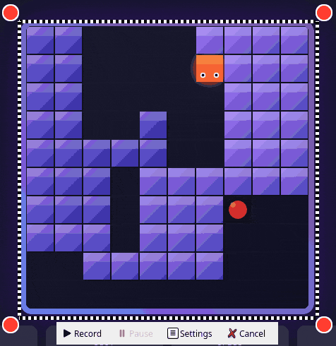
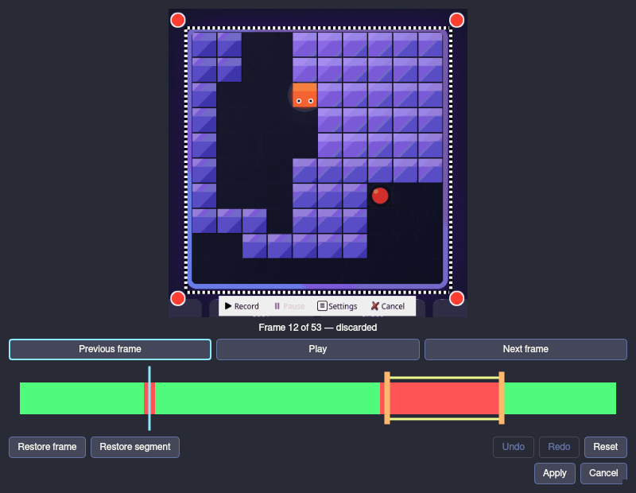

# Hyperland GIF Recorder

Screen-region recording under Hyprland with `grim`, FFmpeg, and optional GIF
post-processing through `gifsicle`.

## Features

- GIF creation from individual frames with an optimized FFmpeg palette
- Configurable GIF compression without removing or reordering frames
- Reusable PyQt6 `RegionSelector`
- Selection border: four red corner dots and an animated marching-ants outline
- Toolbar during recording: record, pause/resume, settings, cancel
- Temporary GIF draft with saving, a mouse-operated frame editor, and discard
- Hyprland runtime configuration: floating, no effects or compositor animations
- Does not modify the personal Hyprland configuration

## Requirements and startup

- Python with PyQt6
- `grim`, `ffmpeg`, and `hyprctl` in `PATH`
- Optional: `gifsicle` in `PATH`; required when gifsicle optimization is enabled

```bash
micromamba activate misc
python recorder.py
```

- Start without arguments: selection, recorder, and local API server
- Output path: printed to stdout only after the draft is successfully saved

Before a start without arguments, the application checks all required programs
in `PATH`. If one or more are missing, it lists all of them on stderr and exits
with status `1` without starting the interface or local server. CLI client
commands only contact an already-running server and do not perform this check.

## Usage

- Left-click a dot: move the selection
- `Shift` + left-click a dot: resize from that corner
- Change monitor: move the selection to the target monitor
- Double-click a dot: start or stop recording
- `Esc`, Cancel, or closing a dot: cancel
- Recording: locks the region, cancel, and settings
- Paused: can be moved but not resized; marching ants become visible again
- Full-screen selection: one handle to collapse and expand the toolbar
- Workspace changes: the pinned selection stays together on its recorder monitor;
  workspace changes on other monitors do not affect it

After stopping, the recording has not yet been published. The toolbar only
shows “Save”, “Edit”, and “Discard”. “Save” creates the final file, “Edit”
opens the timeline frame editor, and “Discard” deletes the hidden draft without
ending the session. A new recording attempt is rejected while a draft exists.

## Frame editor
  
The scalable editor provides a large preview, play/pause, and frame-by-frame
navigation. In the timeline, the blue playhead and the two yellow segment
handles can be dragged entirely with the mouse. “Discard frame”
affects the current frame; “Discard segment” affects the selected range,
including both boundaries. Actions accumulate and can be changed through Undo,
Redo, and Reset. Frames marked in red are discarded.

When the preview is paused, discarded frames can also be viewed individually
and restored. Playback skips them. “Apply” applies the selection to the draft
but does not save a file yet. “Cancel” and closing the dialog discard only the
changes made since opening it. A completely empty edit cannot be applied or
saved.

## GIF compression

In addition to “Recording”, the settings contain the “GIF Compression” section.
“Recording” manages the output directory, filename, frame rate, and cursor.
The compression section manages the maximum width, number of colors, gifsicle,
and its lossy level.

- High Quality: 1440 px, 256 colors, lossless gifsicle optimization
- Balanced: 960 px, 128 colors, lossy level 40; the default for new
  installations
- Small File: 720 px, 96 colors, lossy level 80
- Custom: selected automatically whenever a detail is changed manually

FFmpeg only scales recordings that are wider than the configured maximum width.
It then optimizes them with gifsicle using `--optimize=3`; a lossy option is used
only when the level is greater than zero. This post-processing changes neither
the number or order of frames nor the frame rate or timing. If it fails, the
already-created FFmpeg GIF is retained and the application displays a warning.

When the final file is saved, an unedited draft is published to the target
directory without re-encoding. For edits, `gifsicle --delete` is preferred so
that existing frame data and delays are retained. If `gifsicle` is unavailable,
FFmpeg re-encodes the retained frames using the frame rate, maximum width, color
count, and palette from the recording options. This documented fallback can
normalize variable original frame delays to the recording frame rate. Existing
target files are never silently overwritten; a save dialog appears instead.

## Local control API and CLI

- Unix socket: `$XDG_RUNTIME_DIR/wayland-gif-recorder.sock`
- Socket permissions: `0600`
- No TCP port
- One request per connection: UTF-8 JSON ending with a newline
- Supported commands: `record`, `pause`, `resume`, `stop`, `cancel`, `status`
- Exit codes: `0` success, `1` rejection or unreachable server, `2` invalid usage
- State and result query: `status`, including `last_output_path`

```bash
python recorder.py record
python recorder.py pause
python recorder.py resume
python recorder.py stop
python recorder.py status
python recorder.py cancel
```

```json
{"command":"status"}
```

```json
{"ok":true,"command":"status","recording_state":"recording","selection_active":true,"active_output_path":"/home/user/Videos/recording_2026-08-08_12-30-00.gif","last_output_path":null}
```

## Hyprland key bindings

```ini
bind = SUPER SHIFT, R, exec, python /path/to/Wayland-Gif-Recorder/recorder.py record
bind = SUPER SHIFT, P, exec, python /path/to/Wayland-Gif-Recorder/recorder.py pause
bind = SUPER SHIFT, O, exec, python /path/to/Wayland-Gif-Recorder/recorder.py resume
bind = SUPER SHIFT, S, exec, python /path/to/Wayland-Gif-Recorder/recorder.py stop
bind = SUPER SHIFT, C, exec, python /path/to/Wayland-Gif-Recorder/recorder.py cancel
```

## Recording architecture

The reusable selection component lives in the `region_selector` package. The
application-specific controller, control API, recording, editing, editor, and
settings modules live in the separate `hypr_gif` package. Dependencies point
from `hypr_gif` to `region_selector`, never in the opposite direction.

- `FrameSource`: provides frames; the Wayland implementation is `GrimFrameSource`
- `FrameEncoder`: processes frames; the GIF implementation is `FfmpegGifEncoder`
  with optional gifsicle post-processing
- `GifRecorder`: coordinates the `IDLE`, `STARTING`, `RECORDING`, `PAUSING`,
  `PAUSED`, `RESUMING`, and `STOPPING` states
- `GifDraft` and `GifEditModel`: target path, frame metadata, edits, and
  undo/redo history
- `GifAnalyzer` and `GifExporter`: asynchronous analysis and publishing with a
  gifsicle/FFmpeg fallback

## RegionSelector-API

```python
from PyQt6.QtGui import QAction

from region_selector import Rect, RegionSelector, SelectionInteractionMode

copy_action = QAction("Copy dimensions")
copy_action.triggered.connect(lambda: print("copy"))

selector = RegionSelector(
    initial_rect=Rect(100, 100, 640, 480),
    dot_size=24,
    dot_color="#ff3b30",
    ants_width=2,
    ants_interval_ms=80,
    toolbar_actions=(copy_action,),
    toolbar_gap=8,
    confirm_text="Confirm",
    confirm_icon=None,
    auto_close_on_confirm=True,
)
selector.geometry_changed.connect(print)
selector.confirmed.connect(print)
selector.cancelled.connect(lambda: print("cancelled"))
selector.start()

selector.set_interaction_mode(SelectionInteractionMode.MOVE_ONLY)
selector.set_interaction_enabled(True)
selector.set_marching_ants_visible(False)
selector.set_overlay_visible(False)
capture_geometry = selector.resolve_capture_geometry()
```

- Requirement: an existing `QApplication` before `start()`
- `geometry`: normalized rectangle in global logical Hyprland coordinates
- `resolve_capture_geometry()`: compositor-confirmed inner rectangle or `None`
- `set_overlay_visible()`: hides or restores the complete selection overlay
- Feedback: the Qt signals `geometry_changed`, `confirmed`, `cancelled`, and `error`
- `ants_width` and `ants_interval_ms`: positive values
- `toolbar_gap`: non-negative distance between selection and toolbar
- `toolbar_actions`: preserves order, text, icon, tooltip, enabled state, and
  trigger behavior

## Tests
Install pip dependencies first.

```bash
conda activate your_env
python -m pytest
```
